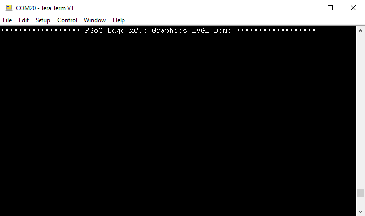

# PSoC&trade; Edge MCU: Graphics LVGL Demo

This code example demonstrates displaying a 2D graphics demo on a 10.1 inch 1024*600 TFT LCD (WF101JTYAHMNB0) using the Light and Versatile Graphics Library (LVGL) on PSoC&trade; Edge MCU. The 2D graphics displays a music player application, which is listed as one of the standard demo on the LVGL page. The LCD is connected via the MIPI Display Serial Interface (DSI) and the code is designed to run in a FreeRTOS environment.

This code example has a three project structure - CM33 Secure, CM33 Non-Secure, and CM55 projects. Extended Boot launches the CM33 Secure project present in RRAM from a fixed location, which then configures the external QSPI flash in XIP mode and launches the CM33 Non-Secure application. Additionally, CM33 Non-Secure application enables CM55 CPU and launches the CM55 application in external flash. The CM55 application implements the logic for this code example.

## Requirements

- [ModusToolbox&trade; software](https://www.infineon.com/modustoolbox) v3.1 or later (tested with v3.1)
- ModusToolbox&trade; PSoC&trade; E84 Early Access Pack. See [Software setup](#software-setup) for more details.
- Edge Protect Tools v1.0.0. See [Software setup](#software-setup) for more details.
- Board support package (BSP) minimum required version for:
   - KIT_PSOCE84_EVK: v0.5.2
- Programming language: C
- Associated parts: All PSoC&trade; Edge E84 MCU parts

## Supported toolchains (make variable 'TOOLCHAIN')

- GNU Arm&reg; embedded compiler v11.3.1 (`GCC_ARM`) - Default value of `TOOLCHAIN`

## Supported kits (make variable 'TARGET')

- **PSoC&trade; Edge E84 Evaluation Kit** (`KIT_PSOCE84_EVK`)

## Hardware setup

This example uses the board's default configuration. See the kit user guide to ensure that the board is configured correctly.

Please ensure below jumper and pin configuration on board.
- Ensure Boot.1 (Boot SW) Pin (P17.6) should be in 'Low'/OFF position
- Ensure J20 and J21 should be in Tristate/Not-Connected (NC) position.

10.1 inch 1024*600 TFT LCD [WF101JTYAHMNB0](https://www.winstar.com.tw/products/tft-lcd/ips-tft/ips-touch.html) is used as MIPI DSI display. Connect the LCD display connector to J38 and touch connector to J37 on PSoC&trade; EDGE E84 EVALUATION KIT.

## Software setup

See the [ModusToolbox&trade; tools package installation guide](https://www.infineon.com/ModusToolboxInstallguide) for information about installing and configuring the tools package.

<details><summary><b>ModusToolbox&trade; PSoC&trade; E84 Early Access Pack</b></summary>
 
1. Download and install the [Infineon Developer Center Launcher](https://www.infineon.com/cms/en/design-support/tools/utilities/infineon-developer-center-idc-launcher/)
2. Login using your Infineon credentials. 
3. Download and install the “ModusToolbox&trade; PSoC&trade; E84 Early Access Pack” from Developer Center Launcher.
    > **Note:** The default installation directory of the Early Access pack is the root "ModusToolbox" installation directory of the respective operating system.<br>

4. After installing the Early Access Pack, use the following system variable to enable the early access environment
    > Variable name: <code>MTB_ENABLE_EARLY_ACCESS</code> <br>
    Variable value: <code>com.ifx.tb.tool.modustoolboxpackpsoce84</code>
    
5. Save the Environment variables and restart ModusToolbox&trade; software. 

</details>

<details><summary><b>Edge Protect Tools</b></summary>

The extended boot requires the first user image to be in MCUboot format. We require Edge Protect Tools package to sign the images or convert the images as per the required format. The EdgeProtectTools package is available as part of the Early Access Pack. It must be installed separately as directed below. <br>

On Windows operating system, open modus-shell and execute the following command:
> <code>pip install --upgrade --force-reinstall **`<install-path>`**/ModusToolbox/packs/ModusToolbox-PSoC-E84-Early-Access-Pack/tools/edgeprotecttools</code>

You also need to put the following paths to the "Path" environment variable and re-order them so that they are at the top of the Path list. 

> <code>**`<install-path>`**/ModusToolbox/tools_3.1/python </code><br>
<code>**`<install-path>`**/ModusToolbox/tools_3.1/python/Scripts </code>

For installation on macOS and Linux operating systems, see section **4.1.2 Software Prerequisites** in _AN235935 – Getting started with PSoC&trade; Edge E84 MCU on ModusToolbox&trade; application note._

NOTE: The default **`<install-path>`** of ModusToolbox™ in Windows operating system is C:/Users/`<USER>`

</details>

Install a terminal emulator if you do not have one. Instructions in this document use [Tera Term](https://teratermproject.github.io/index-en.html).

This example requires no additional software or tools.


## Using the code example

### Create the project

The ModusToolbox&trade; tools package provides the Project Creator as both a GUI tool and a command line tool.

<details><summary><b>Use Project Creator GUI</b></summary>

1. Open the Project Creator GUI tool.

   There are several ways to do this, including launching it from the dashboard or from inside the Eclipse IDE. For more details, see the [Project Creator user guide](https://www.infineon.com/ModusToolboxProjectCreator) (locally available at *{ModusToolbox&trade; install directory}/tools_{version}/project-creator/docs/project-creator.pdf*).

2. On the **Choose Board Support Package (BSP)** page, select a kit supported by this code example. See [Supported kits](#supported-kits-make-variable-target).

   > **Note:** To use this code example for a kit not listed here, you may need to update the source files. If the kit does not have the required resources, the application may not work.

3. On the **Select Application** page:

   a. Select the **Applications(s) Root Path** and the **Target IDE**.

   > **Note:** Depending on how you open the Project Creator tool, these fields may be pre-selected for you.

   b.	Select this code example from the list by enabling its check box.

   > **Note:** You can narrow the list of displayed examples by typing in the filter box.

   c. (Optional) Change the suggested **New Application Name** and **New BSP Name**.

   d. Click **Create** to complete the application creation process.

</details>

<details><summary><b>Use Project Creator CLI</b></summary>

The 'project-creator-cli' tool can be used to create applications from a CLI terminal or from within batch files or shell scripts. This tool is available in the *{ModusToolbox&trade; install directory}/tools_{version}/project-creator/* directory.

Use a CLI terminal to invoke the 'project-creator-cli' tool. On Windows, use the command-line 'modus-shell' program provided in the ModusToolbox&trade; installation instead of a standard Windows command-line application. This shell provides access to all ModusToolbox&trade; tools. You can access it by typing "modus-shell" in the search box in the Windows menu. In Linux and macOS, you can use any terminal application.

The following example clones the "**Graphics LVGL Demo**" application with the desired name "LVGLDemo" configured for the *KIT_PSOCE84_EVK* BSP into the specified working directory, *C:/mtb_projects*:

   ```
   project-creator-cli --board-id KIT_PSOCE84_EVK --app-id mtb-example-psoc-edge-gfx-lvgl-demo --user-app-name LVGLDemo --target-dir "C:/mtb_projects"
   ```

The 'project-creator-cli' tool has the following arguments:

Argument | Description | Required/optional
---------|-------------|-----------
`--board-id` | Defined in the <id> field of the **BSP manifest** | Required
`--app-id`   | Defined in the <id> field of the **CE manifest** | Required
`--target-dir`| Specify the directory in which the application is to be created if you prefer not to use the default current working directory | Optional
`--user-app-name`| Specify the name of the application if you prefer to have a name other than the example's default name | Optional

> **Note:** The project-creator-cli tool uses the `git clone` and `make getlibs` commands to fetch the repository and import the required libraries. For details, see the "Project creator tools" section of the [ModusToolbox&trade; tools package user guide](https://www.infineon.com/ModusToolboxUserGuide) (locally available at {ModusToolbox&trade; install directory}/docs_{version}/mtb_user_guide.pdf).

</details>

### Open the project

After the project has been created, you can open it in your preferred development environment.

<details><summary><b>Eclipse IDE</b></summary>

If you opened the Project Creator tool from the included Eclipse IDE, the project will open in Eclipse automatically.

For more details, see the [Eclipse IDE for ModusToolbox&trade; user guide](https://www.infineon.com/MTBEclipseIDEUserGuide) (locally available at *{ModusToolbox&trade; install directory}/docs_{version}/mt_ide_user_guide.pdf*).

</details>

<details><summary><b>Visual Studio (VS) Code</b></summary>

Launch VS Code manually, and then open the generated *{project-name}.code-workspace* file located in the project directory.

For more details, see the [Visual Studio Code for ModusToolbox&trade; user guide](https://www.infineon.com/MTBVSCodeUserGuide) (locally available at *{ModusToolbox&trade; install directory}/docs_{version}/mt_vscode_user_guide.pdf*).

</details>

<details><summary><b>Keil µVision</b></summary>

Double-click the generated *{project-name}.cprj* file to launch the Keil µVision IDE.

For more details, see the [Keil µVision for ModusToolbox&trade; user guide](https://www.infineon.com/MTBuVisionUserGuide) (locally available at *{ModusToolbox&trade; install directory}/docs_{version}/mt_uvision_user_guide.pdf*).

</details>

<details><summary><b>IAR Embedded Workbench</b></summary>

Open IAR Embedded Workbench manually, and create a new project. Then select the generated *{project-name}.ipcf* file located in the project directory.

For more details, see the [IAR Embedded Workbench for ModusToolbox&trade; user guide](https://www.infineon.com/MTBIARUserGuide) (locally available at *{ModusToolbox&trade; install directory}/docs_{version}/mt_iar_user_guide.pdf*).

</details>

<details><summary><b>Command line</b></summary>

If you prefer to use the CLI, open the appropriate terminal, and navigate to the project directory. On Windows, use the command-line 'modus-shell' program; on Linux and macOS, you can use any terminal application. From there, you can run various `make` commands.

For more details, see the [ModusToolbox&trade; tools package user guide](https://www.infineon.com/ModusToolboxUserGuide) (locally available at *{ModusToolbox&trade; install directory}/docs_{version}/mtb_user_guide.pdf*).

</details>

## Operation


1. Ensure that the 10.1 inch **WF101JTYAHMNB0** LCD is connected to the board. 

2. Connect the board to your PC using the provided USB cable through the KitProg3 USB connector.

3. Open a terminal program and select the KitProg3 COM port. Set the serial port parameters to 8N1 and 115200 baud.

4. Program the board using one of the following:

   <details><summary><b>Using Eclipse IDE</b></summary>

      1. Select the application project in the Project Explorer.

      2. In the **Quick Panel**, scroll down, and click **\<Application Name> Program (KitProg3_MiniProg4)**.
   </details>

   <details><summary><b>In other IDEs</b></summary>

   Follow the instructions in your preferred IDE.
   </details>

   <details><summary><b>Using CLI</b></summary>

     From the terminal, execute the `make program` command to build and program the application using the default toolchain to the default target. The default toolchain is specified in the application's Makefile but you can override this value manually:
      ```
      make program TOOLCHAIN=<toolchain>
      ```

      Example:
      ```
      make program TOOLCHAIN=GCC_ARM
      ```
   </details>

5. After programming, the application starts automatically. Confirm that "PSoC Edge MCU: Graphics LVGL Demo" is displayed on the UART terminal.

   **Figure 1. Terminal output on program startup**

   

6. Observe that the LCD displays a music player demo application. You can use the touch screen to perform various actions such as playing or pausing a track, changing to the next or previous track, and viewing the playlist.

   **Figure 2. LVGL demo**

   

   **Figure 3. LVGL music player**

   


## Debugging

You can debug the example to step through the code.

<details><summary><b>In Eclipse IDE</b></summary>

Use the **\<Application Name> Debug (KitProg3_MiniProg4)** configuration in the **Quick Panel**. For details, see the "Program and debug" section in the [Eclipse IDE for ModusToolbox&trade; user guide](https://www.infineon.com/MTBEclipseIDEUserGuide).

</details>


<details><summary><b>In other IDEs</b></summary>

Follow the instructions in your preferred IDE.
</details>

## Design and implementation

This project uses 10.1 inch [WF101JTYAHMNB0](https://www.winstar.com.tw/products/tft-lcd/ips-tft/ips-touch.html) TFT LCD. The TFT LCD houses a [EK79007AD3](https://www.crystalfontz.com/controllers/Fitipower/EK79007AD3/505/) display controller and uses the MIPI DSI interface.

The design of this application is kept straightforward to help the user get started with code examples on PSoC&trade; Edge MCU devices. All PSoC&trade; Edge E84 MCU applications have a dual-CPU three-project structure to develop code for the CM33 and CM55 cores. The CM33 core has two separate projects for the Secure Processing Environment (SPE) and Non-secure Processing Environment (NSPE). A project folder consists of various subfolders – each denoting a specific aspect of the project. The three project folders are as follows:

**Table 1. Application Projects**

Project | Description
--------|------------------------
proj_cm33_s | Project for CM33 Secure Processing Environment (SPE)
proj_cm33_ns | Project for CM33 Non-secure Processing Environment (NSPE)
proj_cm55 | CM55 Project

In this code example, at device reset, the secured boot process starts from the ROM boot in the Secured Enclave as the Root of Trust. From the Secured Enclave, the boot flow is passed on to the System CPU Subsystem where the secure CM33 application is first started. After all necessary secure configurations, the flow is passed on to the non-secure CM33 application. Resource initialization for this example is performed by this CM33 non-secure project. It configures the system clocks, pins, clock to peripheral connections, and other platform resources. It then enables the CM55 core using the Cy_SysEnableCM55() function and put itself to CPU Sleep mode.

The CM55 application drives the LCD and renders the image using PSoC&trade; Edge graphics subsystem. The graphics subsystem of PSoC&trade; Edge MCU houses an independent 2.5D graphics processing unit (GPU), a display controller (DC), and a MIPI DSI host controller with MIPI D-PHY physical layer interface.

**cm55_ns_gfx_task** initializes the Graphics subsystem and configures the GPU interrupt. After that it calls the `wf101jtyahmnb0_init()` function
to initialize the LCD panel. Once the panel is initialized, required amount of memory is allocated for VGLite draw/blit functions to be consumed by LVGL library.
The `lv_init()` function is used to initialize LVGL and set up the essential components required for LVGL to work correctly. The display and touch  drivers are initialized using `lv_port_disp_init()` and `lv_port_indev_init()` functions respectively. The LVGL demo music player is displayed on the 10.1 inch (WF101JTYAHMNB0) display by calling the LVGL demo widget API `lv_demo_music()`.
In order to switch to other available LVGL demos, user need to enable the `LV_USE_DEMO_<demo_name>` macro in `lv_conf.h` file and call the corresponding `lv_demo_<demo_name>()` API in place of `lv_demo_music()`.


### Resources and settings

**Table 2. Application resources**

 Resource  |  Alias/object     |    Purpose
 :-------- | :-------------    | :------------
 UART (HAL)|cy_retarget_io_uart_obj| UART HAL object used by Retarget-IO for debug UART port
 GFXSS (PDL)    | gfxss     | Graphics subsystem
 GPIO (PDL)| CYBSP_DISP_BL_PWM| Display backlight signal I/O
 GPIO (HAL)| CYBSP_DISP_RST| Display reset signal I/O
 GPIO (HAL)| CYBSP_DISP_TP_INT| Touch interrupt signal I/O
 GPIO (HAL)| CYBSP_DISP_TP_RST| Touch reset signal I/O

<br />

## Related resources

Resources  | Links
-----------|----------------------------------
Application notes  | **AN235935** – Getting started with PSoC&trade; Edge E84 MCU on ModusToolbox&trade; software
Code examples  | [Using ModusToolbox&trade; software](https://github.com/Infineon/Code-Examples-for-ModusToolbox-Software) on GitHub 
Device documentation | PSoC&trade; Edge E84 MCU datasheet 
Development kits | Select your kits from the [Evaluation board finder](https://www.infineon.com/cms/en/design-support/finder-selection-tools/product-finder/evaluation-board) page
Libraries  | **mtb-pdl-cat1** – Peripheral driver library (PDL)  <br /> **mtb-hal-cat1** – Hardware abstraction layer (HAL) library <br /> [retarget-io](https://github.com/Infineon/retarget-io) – Utility library to retarget STDIO messages to a UART port
Tools  | [Eclipse IDE for ModusToolbox&trade; software](https://www.infineon.com/modustoolbox) – ModusToolbox&trade; software is a collection of easy-to-use software and tools enabling rapid development with Infineon MCUs, covering applications from embedded sense and control to wireless and cloud-connected systems using AIROC&trade; Wi-Fi and Bluetooth® connectivity devices. <br />


## Other resources


Infineon provides a wealth of data at www.infineon.com to help you select the right device, and quickly and effectively integrate it into your design.


## Document history


Document title: *CE239259* - *PSoC&trade; Edge MCU: Graphics LVGL Demo*

 Version | Description of change
 ------- | ---------------------
 1.0.0   | New code example

<br>

All referenced product or service names and trademarks are the property of their respective owners.

The Bluetooth&reg; word mark and logos are registered trademarks owned by Bluetooth SIG, Inc., and any use of such marks by Infineon is under license.

---------------------------------------------------------

© Cypress Semiconductor Corporation, 2023. This document is the property of Cypress Semiconductor Corporation, an Infineon Technologies company, and its affiliates ("Cypress").  This document, including any software or firmware included or referenced in this document ("Software"), is owned by Cypress under the intellectual property laws and treaties of the United States and other countries worldwide.  Cypress reserves all rights under such laws and treaties and does not, except as specifically stated in this paragraph, grant any license under its patents, copyrights, trademarks, or other intellectual property rights.  If the Software is not accompanied by a license agreement and you do not otherwise have a written agreement with Cypress governing the use of the Software, then Cypress hereby grants you a personal, non-exclusive, nontransferable license (without the right to sublicense) (1) under its copyright rights in the Software (a) for Software provided in source code form, to modify and reproduce the Software solely for use with Cypress hardware products, only internally within your organization, and (b) to distribute the Software in binary code form externally to end users (either directly or indirectly through resellers and distributors), solely for use on Cypress hardware product units, and (2) under those claims of Cypress's patents that are infringed by the Software (as provided by Cypress, unmodified) to make, use, distribute, and import the Software solely for use with Cypress hardware products.  Any other use, reproduction, modification, translation, or compilation of the Software is prohibited.
<br>
TO THE EXTENT PERMITTED BY APPLICABLE LAW, CYPRESS MAKES NO WARRANTY OF ANY KIND, EXPRESS OR IMPLIED, WITH REGARD TO THIS DOCUMENT OR ANY SOFTWARE OR ACCOMPANYING HARDWARE, INCLUDING, BUT NOT LIMITED TO, THE IMPLIED WARRANTIES OF MERCHANTABILITY AND FITNESS FOR A PARTICULAR PURPOSE.  No computing device can be absolutely secure.  Therefore, despite security measures implemented in Cypress hardware or software products, Cypress shall have no liability arising out of any security breach, such as unauthorized access to or use of a Cypress product. CYPRESS DOES NOT REPRESENT, WARRANT, OR GUARANTEE THAT CYPRESS PRODUCTS, OR SYSTEMS CREATED USING CYPRESS PRODUCTS, WILL BE FREE FROM CORRUPTION, ATTACK, VIRUSES, INTERFERENCE, HACKING, DATA LOSS OR THEFT, OR OTHER SECURITY INTRUSION (collectively, "Security Breach").  Cypress disclaims any liability relating to any Security Breach, and you shall and hereby do release Cypress from any claim, damage, or other liability arising from any Security Breach.  In addition, the products described in these materials may contain design defects or errors known as errata which may cause the product to deviate from published specifications. To the extent permitted by applicable law, Cypress reserves the right to make changes to this document without further notice. Cypress does not assume any liability arising out of the application or use of any product or circuit described in this document. Any information provided in this document, including any sample design information or programming code, is provided only for reference purposes.  It is the responsibility of the user of this document to properly design, program, and test the functionality and safety of any application made of this information and any resulting product.  "High-Risk Device" means any device or system whose failure could cause personal injury, death, or property damage.  Examples of High-Risk Devices are weapons, nuclear installations, surgical implants, and other medical devices.  "Critical Component" means any component of a High-Risk Device whose failure to perform can be reasonably expected to cause, directly or indirectly, the failure of the High-Risk Device, or to affect its safety or effectiveness.  Cypress is not liable, in whole or in part, and you shall and hereby do release Cypress from any claim, damage, or other liability arising from any use of a Cypress product as a Critical Component in a High-Risk Device. You shall indemnify and hold Cypress, including its affiliates, and its directors, officers, employees, agents, distributors, and assigns harmless from and against all claims, costs, damages, and expenses, arising out of any claim, including claims for product liability, personal injury or death, or property damage arising from any use of a Cypress product as a Critical Component in a High-Risk Device. Cypress products are not intended or authorized for use as a Critical Component in any High-Risk Device except to the limited extent that (i) Cypress's published data sheet for the product explicitly states Cypress has qualified the product for use in a specific High-Risk Device, or (ii) Cypress has given you advance written authorization to use the product as a Critical Component in the specific High-Risk Device and you have signed a separate indemnification agreement.
<br>
Cypress, the Cypress logo, and combinations thereof, ModusToolbox, PSoC, CAPSENSE, EZ-USB, F-RAM, and TRAVEO are trademarks or registered trademarks of Cypress or a subsidiary of Cypress in the United States or in other countries. For a more complete list of Cypress trademarks, visit www.infineon.com. Other names and brands may be claimed as property of their respective owners.


